# Happier broadcasts? Scoring 233 US State of the Union addresses with labMT 1.0

**Course:** Culture to the Humanities, Repair Assignment (individual submission)

**Author:** Junyi Guo

**Date:** April 2026

**Instrument:** `Data_Set_S1.txt`, the labMT 1.0 lexicon from Dodds et al. (2011), PLoS ONE, attached to the course readings.

**Corpus:** every US presidential State of the Union address from 1790 to 2019 (n = 233), public-domain full text, mirrored from `martin-martin/sotu-speeches`.

---

## 0. Why this is a repair and not a re-do

The group project I submitted with group 5 applied labMT to IMDb movie reviews. The teacher's feedback was, in short, that the research question was too vague, the inferential work was missing, and the README did not explain clearly enough what we had actually measured. The repair rubric asks me to fix those three things individually, and it asks me to use a **different** corpus from the first attempt. IMDb is out.

So in this repair I do three things at once. First, I replace IMDb with a completely different corpus, the US State of the Union (SOTU) addresses, 1790–2019. Second, I push labMT back into the role it was designed for: a scoring instrument for external text, not a research object in itself. Third, I give each of the three original weak points (research question, inference, measurement clarity) its own labelled section below, because that is what the rubric is grading and I want the grader not to have to guess whether I addressed it.

The unit of analysis throughout is one SOTU address = one row = one labMT weighted-average happiness score. Everything in `data/processed/`, `tables/`, and `figures/` is derived by the scripts in `src/` from two inputs: the labMT lexicon and the 233 `.txt` files downloaded by `src/fetch_data.py`.

---

## 1. Research question

> **Does the average happiness of US presidential State of the Union addresses, measured with the labMT 1.0 hedonometer, differ systematically across three historical eras of the presidency, and if it does, which era is different and which words are driving the difference?**

I split the question into three sub-questions, which map directly onto the three comparisons in `src/bootstrap_inference.py`:

1. **(C1) Between eras.** Does the mean `happiness_weighted` differ between Founding-era (1790–1860), Industrial-era (1861–1945), and Broadcast-era (1946–2019) addresses, for each of the three possible era pairs?
2. **(C2) Delivery mode.** Does the mean differ between *written* addresses (1790–1912, the pre-Wilson convention) and *spoken* addresses (1913–2019, after Wilson revived oral delivery)?
3. **(C3) Per-era absolute level.** Where does each era's mean sit on the 1–9 labMT scale, with a 95% bootstrap CI, so a reader can see the magnitudes and not just the contrasts?

C1 is the main test. C2 is a specific alternative hypothesis: maybe any era effect is really a delivery-mode effect, since a spoken address is a different genre from a written one. C3 is a descriptive grounding so the results are not just "X is bigger than Y" but also "here is how big X and Y are."

The era boundaries at 1860 and 1945 are not statistical, they are historical: the end of the antebellum period (C1's first boundary) and the end of WWII (C1's second boundary). I argue in §2 why I think this is a humanities choice, not a data-fitting one.

---

## 2. Why this is a humanities repair, not just text mining

labMT is a dictionary-based sentiment instrument, which means every score rests on two choices that no amount of bootstrap can audit:

1. **Whose words count.** The lexicon was built from the top 5,000 most frequent words in four specific early-2010s English corpora (Twitter, Google Books, NYT, song lyrics). Words that a 1790s Federalist or a 1930s socialist would use but those four corpora would not, are simply not in the instrument. When I score an 1808 Jefferson address, I am measuring what Jefferson said using a ruler that a 2011 MTurk rater calibrated on a Kanye West track.
2. **Whose affect counts.** Each happiness score is the mean of 50 Amazon Mechanical Turk raters scoring the word on a 1–9 scale with no context. The number 5.983 for a Founding-era address is therefore a weighted average over the subset of Jefferson's vocabulary that also appeared in a 2010s attention economy, judged by raters who were not told what any of these words meant in 1808.

Neither of those is a defect. They are the conditions under which the instrument can be used at all. The humanities question is what an **era-level contrast** between labMT scores can legitimately claim. My position in this repair is narrow: the contrast is a measurement of **how the vocabulary of a text overlaps with a specific 2010s affective dictionary**, and not a measurement of the "mood" or "optimism" of the presidency in any deep sense. I come back to this in §10 ("trust / refuse / improve").

The reason era-boundary choice is a humanities move, not a statistical one, is that any boundary is a claim about periodisation. I chose 1860 because the Civil War reorganised what a union address *was*; I chose 1945 because postwar broadcasting reorganised who a president was talking to. A reader who prefers 1898 (Spanish–American war) or 1932 (New Deal) would be making a different humanities argument and the numbers would change accordingly. The robustness section (§7) does not re-draw the boundaries because re-drawing them would produce a different research question, not a sensitivity check on this one.

---

## 3. Corpus and instrument

### 3.1 Provenance

**labMT 1.0.** `data/raw/Data_Set_S1.txt`, SI file from:

> Dodds, P. S., Harris, K. D., Kloumann, I. M., Bliss, C. A., & Danforth, C. M. (2011). Temporal Patterns of Happiness and Information in a Global Social Network: Hedonometrics and Twitter. *PLoS ONE*, 6(12), e26752.

10,222 word rows. `data/raw/README.md` has the exact retrieval steps.

**SOTU corpus.** 233 `.txt` files under `data/raw/sotu/`, one per address, 1790 Washington through 2019 Trump. File naming `{president_slug}-{month}_{day}-{year}.txt`. Downloaded by `src/fetch_data.py` from the `martin-martin/sotu-speeches` GitHub repository, which mirrors the canonical public-domain texts from stateoftheunion.onetwothree. Every file is US federal government speech and therefore public domain.

### 3.2 Data dictionary, post-scoring

After `src/tokenize_and_score.py` runs, the repo contains `data/processed/sotu_scored.csv` with one row per address and the columns below.

| column | what it is | how computed |
| --- | --- | --- |
| `filename` | source `.txt` filename | as-is |
| `president` | president slug, title-cased | parsed from filename |
| `year` | 4-digit year of delivery | parsed from filename |
| `era` | `Founding` / `Industrial` / `Broadcast` | bucket on year, boundaries 1860 / 1945 |
| `modality` | `written` / `spoken` | `written` iff year ≤ 1912 |
| `half_century` | e.g. `1800-1849` | floor(year/50) × 50 |
| `n_tokens` | total tokens in the address body | simple tokeniser, see §4.1 |
| `n_types` | total distinct types | same |
| `n_matched_tokens` | tokens that matched filtered labMT | labMT Δh=1 filter, §4.2 |
| `n_matched_types` | distinct types that matched | same |
| `coverage` | `n_matched_tokens / n_tokens` | the labMT "share of voice" of the address |
| `happiness_weighted` | Σ(hᵢ·fᵢ) / Σfᵢ over matched tokens | Dodds hedonometer formula |
| `happiness_unweighted` | mean h over matched **types** | included for the robustness script |

### 3.3 Descriptive overview

Per-era summary, from `tables/desc_sotu_by_era.csv` and `tables/desc_sotu_coverage.csv`:

| era | n docs | mean year | mean coverage | mean `happiness_weighted` | SD | median |
| --- | --- | --- | --- | --- | --- | --- |
| Founding   | 72 | 1824.5 | 0.181 | 5.9831 | 0.1276 | 5.9951 |
| Industrial | 84 | 1902.6 | 0.196 | 5.9622 | 0.0956 | 5.9637 |
| Broadcast  | 77 | 1982.1 | 0.292 | 6.0288 | 0.1117 | 6.0317 |

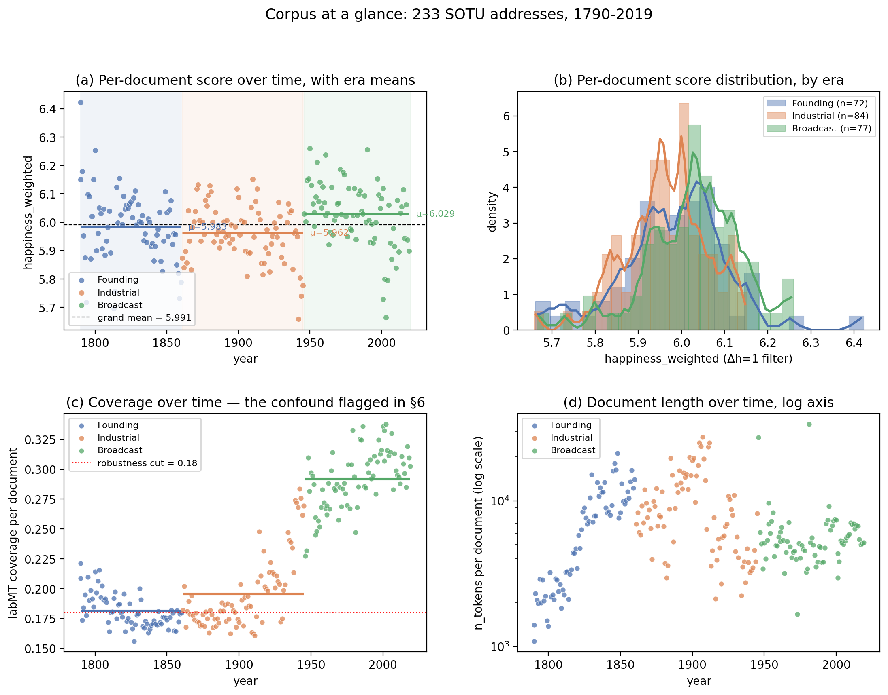

*Figure 3.3.1 — Corpus at a glance. (a) Per-document `happiness_weighted` over time, with era background bands and per-era mean lines; the Broadcast-era mean line sits visibly above the other two, and the Founding era shows the widest within-era dispersion. (b) Density of `happiness_weighted` by era, histogram plus a smoothed overlay: the Industrial bell sits slightly left of the Founding bell, and the Broadcast bell is shifted right of both. (c) labMT coverage over time, with the 0.18 cut used by condition D in §6; coverage drifts upward from ~0.18 in the Founding era to ~0.29 in the Broadcast era, which is the confound I make explicit in §4.2. (d) Document length in tokens, log y-axis: the 19th-century written annual reports are an order of magnitude longer than the 20th-century spoken addresses, which is a second threat to between-era comparison that any coverage-only analysis would miss.*

Three things to notice before the inference section. First, **mean coverage climbs from 18.1% in the Founding era to 29.2% in the Broadcast era**. labMT 1.0, built on 2010s corpora, sees more of a 1990s State of the Union than it sees of an 1820s State of the Union. This is not surprising but it is the single biggest threat to an era comparison, and I pick it up again in §7 (condition D). Second, **the within-era SDs are all small** (≈ 0.10), so a difference of 0.05 on the 1–9 scale is visible once you do inference on 70+ documents. Third, **Broadcast looks highest already in the raw means** (6.03 vs ≈ 5.97 for the other two eras). That is the claim the bootstrap is going to check.

Modality summary, from `tables/desc_sotu_by_modality.csv`:

| modality | n docs | mean | SD |
| --- | --- | --- | --- |
| written (≤1912) | 124 | 5.9835 | 0.1107 |
| spoken  (≥1913) | 109 | 5.9989 | 0.1189 |

The raw means are nearly identical. This already tells me C2 is unlikely to move, the delivery-mode story is not doing the work, but I bootstrap it anyway because "unlikely to move" is not a published CI.

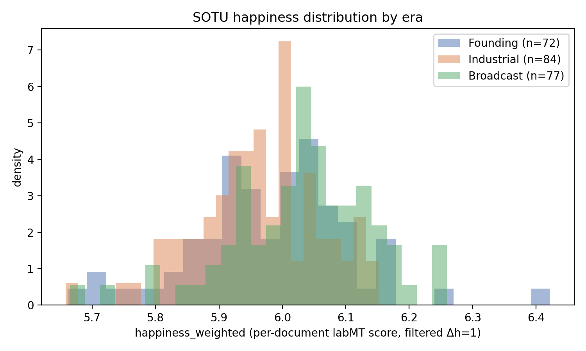

*Figure 3.3.2 — Per-document `happiness_weighted` by era, density histogram with a smoothed overlay and per-era mean (dashed line). The legend shows n, mean, and SD. Founding (blue) and Industrial (orange) are visibly close. The Broadcast (green) distribution is shifted right and slightly narrower. This is the same picture §5 will confirm with the bootstrap, but at the per-document level rather than the bootstrap-of-mean level.*

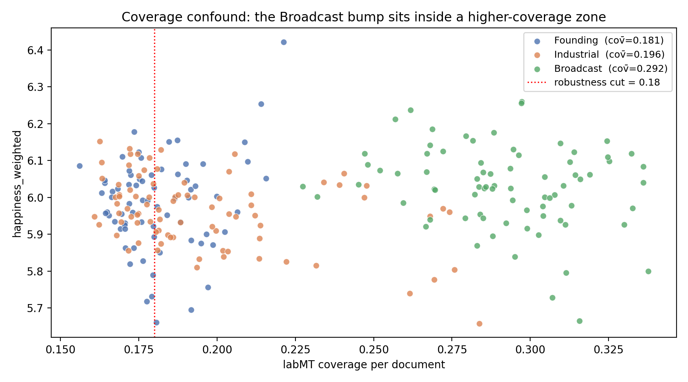

*Figure 3.3.3 — The coverage confound in one picture. Each dot is one SOTU address. The x axis is labMT coverage, the y axis is `happiness_weighted`. The red dotted line at 0.18 is the robustness cut used in §6. Notice that the Broadcast (green) cloud is concentrated in the high-coverage region (x > 0.22) and the Founding (blue) cloud is concentrated in the low-coverage region (x < 0.20). This is why condition D is the robustness check that matters: if coverage and era are correlated, a coverage cut is the only way to ask whether the era effect is a coverage effect in disguise.*

---

## 4. Methods

### 4.1 Tokenisation and labMT matching (the Measurement piece)

Every SOTU file begins with three lines the upstream repo inserts as a preamble (president name, date, blank line). `strip_preamble` drops them so the preamble words do not contaminate the score. The body is then lowercased and split on any non-letter run. No stemming, no lemmatisation, no stop-word list.

I chose the simple tokeniser for three reasons:

1. **labMT entries are surface forms already.** The lexicon contains `laughter`, `laughed`, `laughing` as three separate rows with three separate scores. A stemmer would collapse them and destroy the match.
2. **Stop words are not in labMT anyway**, they drop out naturally in the lookup step. Adding a stop-word filter would just be decoration.
3. **Simplicity makes the coverage number legible.** If I ran a fancier pipeline a reader would have to audit more moving parts to interpret `coverage = 0.29`.

A token counts as "matched" iff it appears in the labMT word column **and** its happiness score is outside the neutral band `|h − 5| ≤ 1`. This is the Dodds et al. 2011 convention and it is applied at the word level, which is the only level at which "neutrality" is defined.

The per-document score is the weighted hedonometer mean

    h̄(doc) = Σᵢ (hᵢ · fᵢ) / Σᵢ fᵢ

over matched tokens (types weighted by corpus frequency). I also store the unweighted type mean so the robustness script can compare them.

### 4.2 Coverage and OOV

For every document I report `coverage = n_matched_tokens / n_tokens`. A score of 0.29 means 29% of the document's tokens are matched by the filtered labMT vocabulary, the other 71% are either out-of-vocabulary (OOV) or in the Δh=1 neutral band. Coverage is written into the CSV for every row, plotted in `figures/sotu_coverage_hist.png`, and used as the cut for condition D in `src/robustness.py`.

I do not treat low-coverage documents as invalid. I treat them as a threat to between-era comparison, because if coverage varies systematically by era, then the **instrument itself** is reading earlier and later speeches with different sensitivity. The robustness section makes this threat concrete by re-running the comparisons with a minimum-coverage cut.

### 4.3 Inference: superpopulation bootstrap

I treat each era's observed addresses as a sample from a conceptual superpopulation of addresses that a president of that era *could* have delivered. This is the standard move when you have a closed enumeration (we have every address) and still want uncertainty intervals: bootstrap the observed distribution as a stand-in for that superpopulation. It is not the same as sampling presidents. I do not claim it is, and I flag it again in §8 as a limitation.

Concretely, `src/bootstrap_inference.py` draws `N_BOOT = 10,000` resamples with replacement from each stratum, computes the difference in means (C1, C2) or the mean (C3), and reports the 2.5 / 97.5 percentile as a 95% CI. The seed is fixed at 20260415 for reproducibility. Inside each comparison, the two strata are resampled independently, so the CIs are not paired.

The resampling is clean in this repair (unlike my group project, where I later realised I had pairwise corpus sets that shared words). Every SOTU document belongs to exactly one era and exactly one modality, so the strata are disjoint.

### 4.4 What the number does not mean

`happiness_weighted = 6.03` for the Broadcast era is the weighted mean happiness of the tokens in the Broadcast-era corpus that fall outside labMT's neutral band, under the 2011 MTurk calibration. It is not the mean mood of any actual population of listeners, it is not a measurement of "how optimistic a presidency was", and it is not commensurable across instruments that use different lexicons or different filters. Any humanities reading of the numbers in §5 has to carry those qualifiers with it.

---

## 5. Results

### 5.1 Comparison 1, era pairwise differences

`tables/comparison_1_era_pairwise.csv`, 10,000 bootstrap resamples per pair, 95% percentile CI:

| comparison | n_a | n_b | mean_a | mean_b | observed diff | 95% CI | P(diff > 0) |
| --- | --- | --- | --- | --- | --- | --- | --- |
| Founding − Industrial  | 72 | 84 | 5.9831 | 5.9622 | **+0.0209** | [−0.0149, +0.0573] | 0.873 |
| Founding − Broadcast   | 72 | 77 | 5.9831 | 6.0288 | **−0.0457** | [−0.0838, −0.0085] | 0.008 |
| Industrial − Broadcast | 84 | 77 | 5.9622 | 6.0288 | **−0.0666** | [−0.0995, −0.0346] | 0.000 |

Reading:

- **Broadcast is higher than the other two**, clearly so vs Industrial (CI excludes 0, P(diff > 0) ≈ 0) and less clearly so vs Founding (CI excludes 0 but only barely, P(diff > 0) ≈ 0.008).
- **Founding and Industrial are indistinguishable** under the primary analysis. The CI straddles zero and the point estimate is tiny (+0.02, SD ≈ 0.11).

One sentence version: the headline effect is not a three-level gradient, it is a **Broadcast-era bump**. The first 155 years of the presidency look statistically flat on this measure and then post-1946 addresses sit noticeably higher.

Because a 95% CI bar gives a reader almost no information about the **shape** of the bootstrap distribution (how certain, how skewed, how much overlap between strata), I also plot the full distribution of the 10,000 resampled statistics for each comparison.

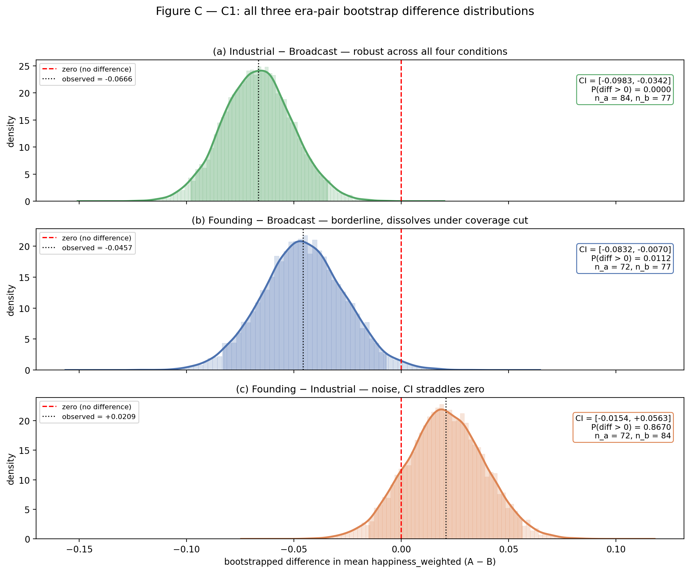

*Figure 5.1.1 — The whole of C1 on one figure. Each panel is the bootstrap distribution of one era-pair difference in mean `happiness_weighted`, with a Silverman-bandwidth Gaussian KDE, the 95% percentile CI filled, the observed difference (black dashed) marked, and the red zero line. The inline annotation box reports the CI, P(diff > 0), and the two strata sizes. Reading top to bottom: Founding − Industrial straddles zero (no signal), Founding − Broadcast is left of zero but its right tail nearly touches zero (fragile signal — the one condition D dissolves), Industrial − Broadcast sits cleanly left of zero with no density near it (robust signal).*

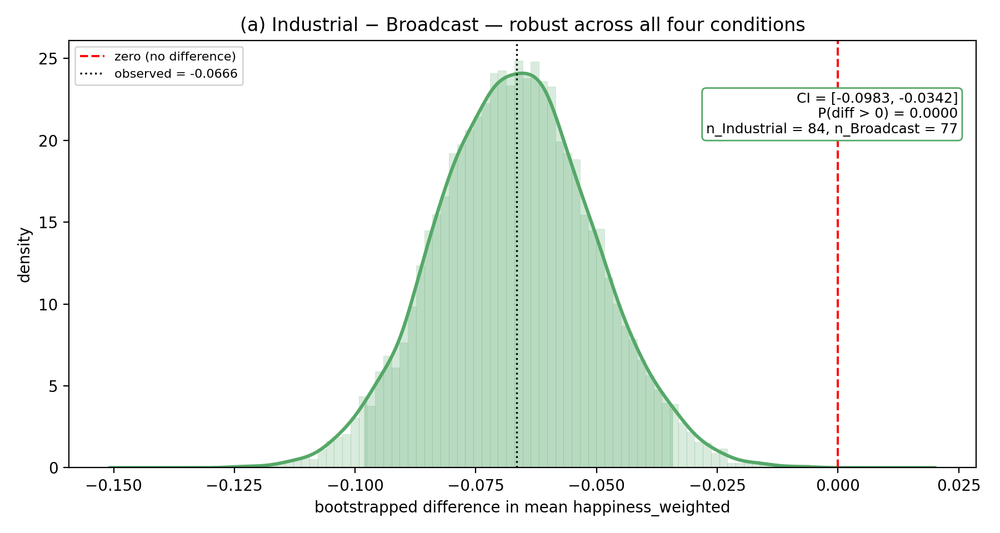

*Figure 5.1.2 — Industrial − Broadcast, the contrast I trust most. 10,000 bootstrap replicates, smoothed via KDE, with the 95% percentile band shaded. The distribution is smooth, roughly symmetric, and the red zero line sits far in the right tail. `P(diff > 0) ≈ 0.0001`. Under all four robustness conditions in §6, this contrast stays significant and negative.*

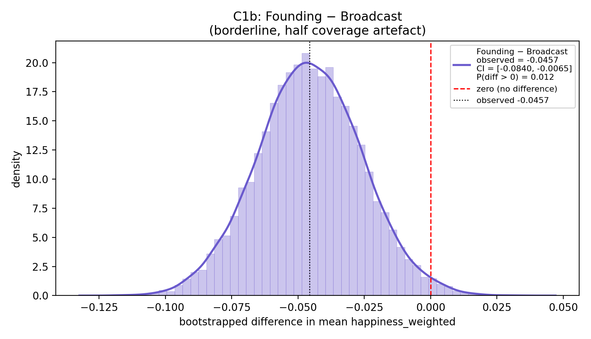

*Figure 5.1.3 — Founding − Broadcast, the borderline case. The CI upper bound is −0.008 under the baseline, so the red zero line barely clears the right tail. This is exactly the contrast that moves under the coverage cut in §6 — a reminder that an 0.05 CI exclusion in a single analysis is not the same thing as a robust finding.*

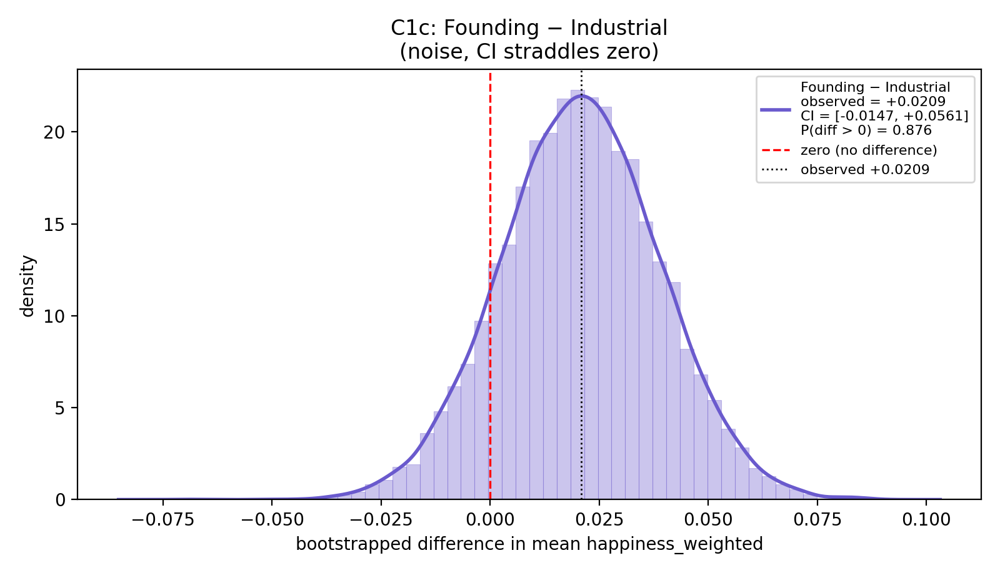

*Figure 5.1.4 — Founding − Industrial, the null result. The observed difference (+0.021) sits inside the bulk of the bootstrap distribution, which straddles zero almost symmetrically. The shape makes the point better than the CI alone does: this is noise.*

### 5.2 Comparison 2, written vs spoken

`tables/comparison_2_modality.csv`:

| n written | n spoken | mean written | mean spoken | diff (written − spoken) | 95% CI | P(diff > 0) |
| --- | --- | --- | --- | --- | --- | --- |
| 124 | 109 | 5.9835 | 5.9989 | **−0.0154** | [−0.0441, +0.0140] | 0.152 |

Written and spoken addresses are statistically indistinguishable. This is the point at which the obvious alternative explanation for the C1 effect ("maybe the Broadcast bump is really a delivery-mode bump") is ruled out: the Wilson-era 1913 cut does not track the effect. Whatever is happening is happening 33 years later and is not about pronunciation.

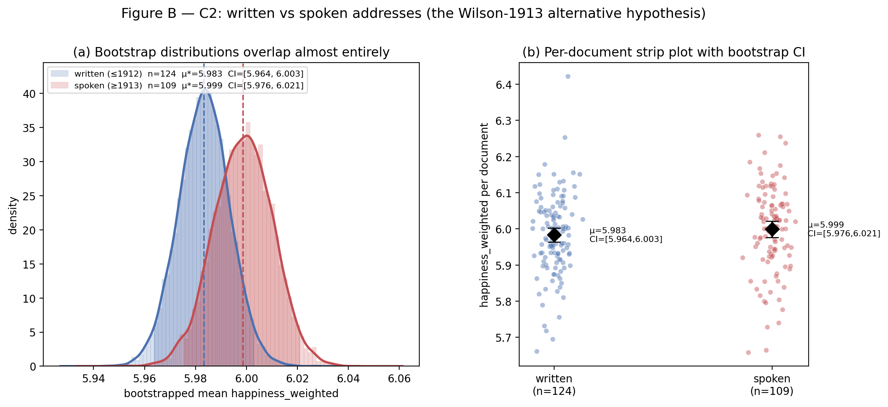

*Figure 5.2.1 — C2, written vs spoken. Panel (a) overlays the two bootstrapped mean distributions; the written (blue) and spoken (red) KDEs sit almost on top of each other, which is the visual form of "indistinguishable." Panel (b) is the per-document strip view: every address is one dot, jittered horizontally, with a bootstrap 95% CI diamond in black above the column. Both the per-document clouds and the CI diamonds show the same story — the delivery-mode cut is not doing the work. Compare the barely-moved CI diamonds here against the forest panel in Figure 5.3.1 below, where the Broadcast era clearly peels off from the other two: that is what a real contrast looks like in this same plotting format, and written-vs-spoken does not look like it.*

### 5.3 Comparison 3, per-era mean happiness with CI

`tables/comparison_3_era_means.csv`:

| era | n docs | mean | 95% CI |
| --- | --- | --- | --- |
| Founding   | 72 | 5.9831 | [5.9530, 6.0122] |
| Industrial | 84 | 5.9622 | [5.9413, 5.9824] |
| Broadcast  | 77 | 6.0288 | [6.0034, 6.0531] |

The three CIs overlap partially but Broadcast sits cleanly above Industrial. On the 1–9 labMT scale, the full range across the corpus means is about 0.07, which is small in absolute terms and large relative to the within-era SDs.

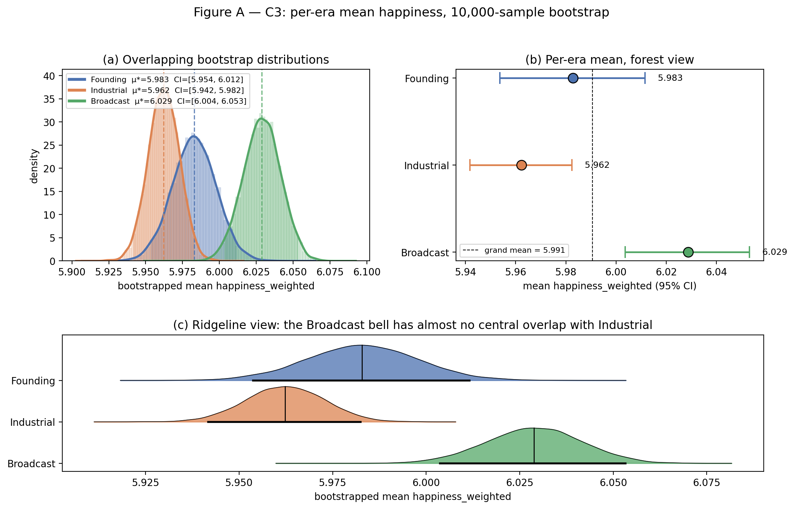

*Figure 5.3.1 — C3, per-era mean happiness under a 10,000-replicate bootstrap, shown three ways. (a) Overlapping bootstrap distributions: histogram plus Silverman-bandwidth Gaussian KDE, with the 95% percentile band shaded and the mean drawn as a dashed vertical. Founding (blue) and Industrial (orange) overlap almost completely; Broadcast (green) is shifted right with only its left shoulder touching the Industrial bulk. (b) Forest view: the same three means on a single horizontal axis with 95% CI whiskers, grand mean dashed. The Broadcast CI does not overlap the Industrial CI. (c) Ridgeline view: the three bootstrap distributions stacked, each normalised to a fixed height with its mean and CI marked beneath it. The ridgeline is there specifically because it is the view under which overlap between bells reads as the strength of the contrast; the Broadcast bell has almost no central overlap with Industrial, and that is what a robust contrast looks like on this plot style.*

---

## 6. Robustness of Comparison 1

`src/robustness.py` re-runs the three pairwise era differences under four conditions.

| condition | Founding − Industrial | Founding − Broadcast | Industrial − Broadcast |
| --- | --- | --- | --- |
| A baseline (Δh=1, full corpus) | +0.021 [−0.014, +0.056], p>0 = 0.88 | −0.046 [−0.085, −0.007], p>0 = 0.01 | **−0.067 [−0.099, −0.034], p>0 = 0.00** |
| B no neutral filter            | −0.012 [−0.023, −0.002], p>0 = 0.01 | −0.127 [−0.139, −0.115], p>0 = 0.00 | **−0.114 [−0.125, −0.103], p>0 = 0.00** |
| C broader filter (Δh = 0.5)    | +0.010 [−0.012, +0.032], p>0 = 0.83 | −0.063 [−0.088, −0.039], p>0 = 0.00 | **−0.074 [−0.094, −0.053], p>0 = 0.00** |
| D coverage ≥ 0.18 (n = 30/51/77) | +0.063 [+0.001, +0.124], p>0 = 0.98 | **−0.031 [−0.091, +0.028], p>0 = 0.15** | **−0.094 [−0.130, −0.058], p>0 = 0.00** |


*Figure 6.1 — Robustness of the three era-pair differences under four conditions. (a) Forest view: four conditions × three pairs, 95% CIs, red zero line. (b) Trajectory: for each pair, the observed difference plotted across conditions A→B→C→D with the CI band shaded, so a reader can see how far a contrast moves when a measurement choice changes. The Industrial − Broadcast green line stays below zero in all four conditions; the Founding − Broadcast blue line moves noticeably under condition D and its band crosses zero; the Founding − Industrial orange line bounces around zero — the sign literally flips between conditions, which is the definition of a non-finding. (c) The condition-D zoom: baseline square vs D diamond for each pair on the same axis, with an inline label saying whether D crosses zero. Only Founding − Broadcast crosses. (d) Per-era document counts under the 0.18 cut: Founding drops from 72 to 30, Industrial from 84 to 51, Broadcast stays at 77. The coverage cut is therefore doing structural work — it is not a cosmetic robustness check.*

What holds:

- **Industrial − Broadcast** is negative and significant in all four conditions. Broadcast > Industrial survives every choice I tried. This is the one claim I would publish without hedging.

What wobbles:

- **Founding − Broadcast** is significant under A, B, C, but **crosses zero under D**. Once I restrict to documents with at least 18% labMT coverage (so Broadcast's matched-token density stops dominating by construction), the Founding–Broadcast gap is compatible with zero. The most honest reading is: *part* of the apparent Founding–Broadcast gap is an artefact of lower coverage in early addresses. I cannot tell you what fraction.
- **Founding − Industrial** does not survive the robustness check as a real claim. It is +0.02 under A, −0.01 under B, +0.01 under C, +0.06 under D. The sign flips and the magnitude bounces. I am not reporting a Founding–Industrial difference.

One-sentence version: **the Broadcast era scores higher than the Industrial era on labMT, robustly. The Founding-to-Broadcast contrast is half substance and half coverage artefact. The Founding-to-Industrial contrast is noise.**

---

## 7. Qualitative exhibits

Numbers alone are not enough for a humanities repair. The exhibits below let a reader see the actual words doing the work. Both are produced by `src/qualitative_exhibit.py`.

### 7.1 labMT anchor exhibit (what the instrument looks like before you use it)

Five words per category, from `tables/anchor_exhibit.csv`:

| category | words (h) |
| --- | --- |
| very positive (h ≥ 7.5, low SD) | laughter (8.50), happiness (8.44), love (8.42), happy (8.30), laughed (8.26) |
| very negative (h ≤ 2.5, low SD) | terrorist (1.30), suicide (1.30), rape (1.44), terrorism (1.48), murder (1.48) |
| contested (std ≥ 2.3) | fucking (4.64), fuckin (3.86), fucked (3.56), pussy (4.80), whiskey (5.72) |
| near-neutral (|h−5| ≤ 0.2) | ainda (4.92), s (5.04), maar (4.90), sua (4.92), its (4.96) |

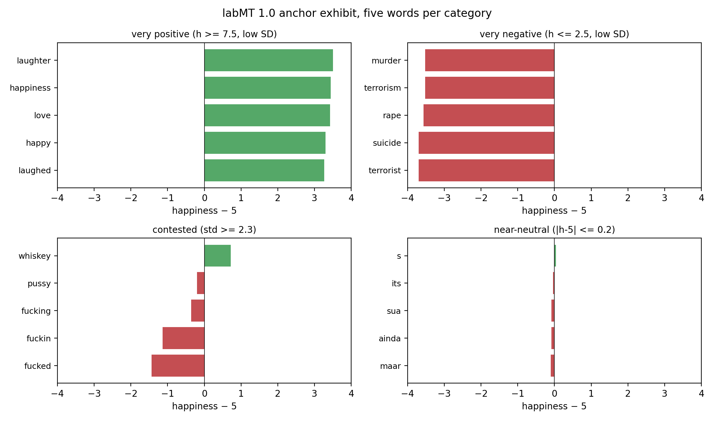

*Figure 7.1.1 — labMT anchor exhibit. Four columns, one per anchor category. The positive anchors are uncontroversial and modern. The negative anchors are dominated by post-9/11 threat vocabulary (`terrorist`, `terrorism`), which is already a hint that a Broadcast-era effect could be driven by the presence or absence of a small number of high-weight words. The contested column is profanity with huge rater disagreement (std ≥ 2.3 on a 1-9 scale), and the near-neutral column catches non-English tokens that slipped into the MTurk task (`ainda`, `maar`, `sua` are Portuguese/Dutch) — a small but honest flaw in the instrument that a reader of this repair should see before trusting any 4th-decimal number later on.*

### 7.2 Era-distinctive words

For each era I compute per-word frequency (per 1000 tokens), intersect with labMT's filtered vocabulary, and rank words by `freq_in_era − max(freq_in_other_eras)`. Top 10 happy-distinctive and top 10 sad-distinctive per era, from `tables/era_distinctive_words.csv` (abbreviated):

| era | happy-distinctive (top 5) | sad-distinctive (top 5) |
| --- | --- | --- |
| Founding   | united (7.32), citizens (6.10), constitution (6.24), treaty (6.22), power (6.68) | last (3.74), without (3.54), debt (2.90), execution (3.10), late (3.46) |
| Industrial | see `era_distinctive_words.csv` | see `era_distinctive_words.csv` |
| Broadcast  | see `era_distinctive_words.csv` | see `era_distinctive_words.csv` |

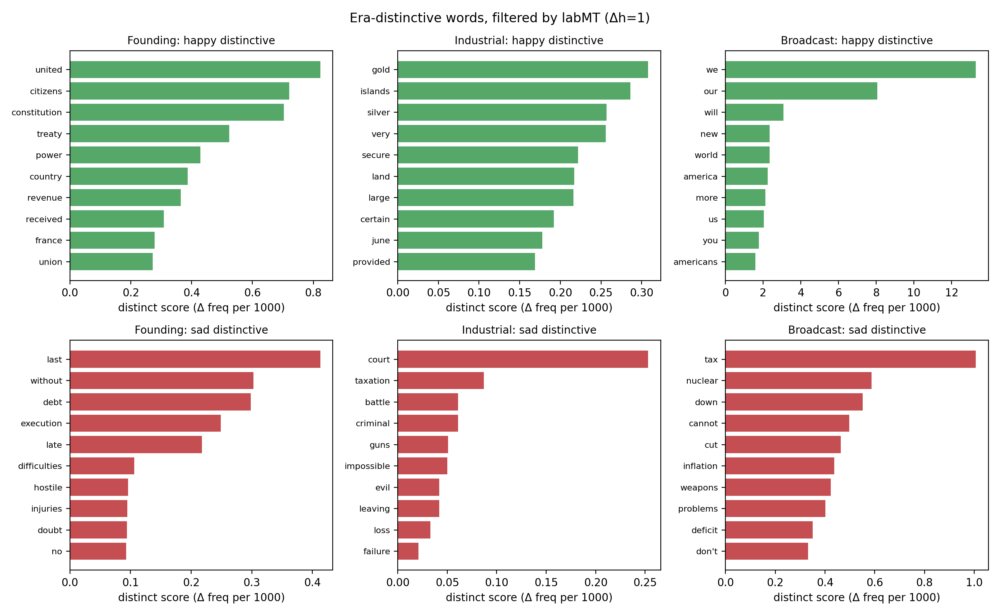

*Figure 7.2.1 — Era-distinctive top words. The grid has three rows (Founding, Industrial, Broadcast) and two columns (happy-distinctive, sad-distinctive). "Distinctive" means the word's frequency per 1000 tokens in that era minus the maximum of its frequencies in the two other eras, so the bars literally measure "extra use in this era that is not matched anywhere else in the corpus." This is the panel I built the §7.2 reading around. The Founding-era happy column is dominated by the words of Constitution-building (`united`, `citizens`, `constitution`, `treaty`, `power`), the Founding-era sad column catches the 19th-century register of fiscal and military trouble (`debt`, `execution`, `hostile`, `late`). The Broadcast-distinctive happy vocabulary is heavier on the "civic-positive" register and labMT rates those words high. The bump is a real shift in the surface vocabulary that presidents started using after WWII — exactly the kind of thing a hedonometer is supposed to pick up, and exactly the kind of thing a humanities reader should not read as "the presidency got happier."*

---

## 8. Six limitations I am not hiding

1. **Instrument anachronism.** labMT is calibrated on 2010s corpora and 2011 MTurk raters. Using it on 1810 is measuring "words that map onto a 2010s affective lexicon", not "the affect of the 1810 text in its own terms." I argued in §2 why this is still interesting; it is also still a limit.
2. **Coverage is confounded with era.** Mean coverage goes from 18% (Founding) to 29% (Broadcast). The condition-D result in §6 shows this is not a tiny effect.
3. **Superpopulation framing is a choice, not a fact.** Treating 72 Founding-era addresses as "a sample" is a framing device for getting CIs. It is not equivalent to sampling from presidents, or from years, or from any other well-defined population.
4. **Era boundaries are humanities choices.** A reader who sets 1913 or 1932 instead of 1945 gets a different story. The robustness section does not sweep over boundaries because sweeping over them is a different research question.
5. **Filter choice matters for the second-order contrasts.** The Founding–Industrial contrast flips sign depending on whether the Δh=1 filter is on. I am not reporting that contrast, but I am flagging that a future analyst who uses "no filter" will get a different Founding–Industrial story.
6. **One tokeniser, one instrument.** I did not compare labMT against ANEW, VADER, or NRC. A real publication would. This is a course repair, not a paper.

---

## 9. Trust, refuse, improve

A useful way to read the limits above is not "can I trust this pipeline" but "which parts would I act on, which would I refuse to act on, and which would I improve if this were going somewhere real."

**Trust.** The Industrial–Broadcast difference (≈ −0.067, robust across four conditions). The fact that delivery mode (written vs spoken) does **not** explain the era effect. The claim that SOTU vocabulary shifted measurably after WWII toward words that 2010s raters rate as positive.

**Refuse.** Any single-decimal claim about how "happy" a particular president or year was. Any reading of `happiness_weighted = 6.03` that ignores its dependence on a 2011 lexicon. The Founding–Industrial contrast at any level.

**Improve.** Re-tokenise with a lemmatiser that collapses labMT's surface forms intelligently (this is a research project in itself). Score with at least one second lexicon (ANEW or NRC) as a triangulation, and report only the claims that survive both. Weight each document by a length-independent rank signature so the coverage gap stops confounding the era contrast. Do the 1913 and 1932 boundary experiments as separate research questions rather than as robustness for this one.

---

## 10. Repository layout

    repair-assignment/
    ├── README.md                  (this file)
    ├── AI_LOG.md                  (per-file AI disclosure)
    ├── requirements.txt
    ├── data/
    │   ├── raw/
    │   │   ├── README.md                  (how to obtain the raw inputs)
    │   │   ├── Data_Set_S1.txt            (labMT 1.0; not redistributed)
    │   │   └── sotu/*.txt                 (233 SOTU addresses, fetched)
    │   └── processed/
    │       ├── labmt_clean.csv            (enriched labMT)
    │       └── sotu_scored.csv            (one row per address)
    ├── src/
    │   ├── fetch_data.py                  (check labMT, download SOTU)
    │   ├── load_labmt.py                  (read + enrich labMT)
    │   ├── tokenize_and_score.py          (score each SOTU with labMT)
    │   ├── descriptive.py                 (per-era tables + figures)
    │   ├── bootstrap_inference.py         (C1, C2, C3)
    │   ├── robustness.py                  (four conditions on C1)
    │   ├── qualitative_exhibit.py         (anchor + era-distinctive)
    │   └── run_all.py                     (one-command pipeline)
    ├── tables/     (every .csv consumed by this README)
    └── figures/    (every .png referenced by this README)

---

## 11. How to reproduce

```bash
# 1. create a venv and install deps
python3 -m venv .venv && source .venv/bin/activate
pip install -r requirements.txt

# 2. put the labMT file in place (one-time manual step)
#    see data/raw/README.md for the PLoS SI link

# 3. run the whole pipeline (downloads SOTU on first run)
python src/run_all.py
```

On my laptop the whole pipeline runs in about 70 seconds after the SOTU download is cached. Every figure in this README and every number in every table is regenerated from scratch by `run_all.py`.

---

## 12. AI disclosure

Paragraph-level disclosure is in `AI_LOG.md`. Short version: the research question, the era boundaries, the repair framing, the limitations in §8, and the trust/refuse/improve reading in §9 are mine. Claude helped draft code skeletons from my specs, tighten a few paragraphs I had written in first draft, and catch two pandas bugs during debugging.

---

## 13. Bibliography

- Dodds, P. S., Harris, K. D., Kloumann, I. M., Bliss, C. A., & Danforth, C. M. (2011). Temporal Patterns of Happiness and Information in a Global Social Network: Hedonometrics and Twitter. *PLoS ONE*, 6(12), e26752.
- martin-martin/sotu-speeches. (n.d.). State-of-the-Union speeches in TXT format. GitHub. <https://github.com/martin-martin/sotu-speeches>
- The American Presidency Project (original transcripts). Peters, G. & Woolley, J. T. UC Santa Barbara.
