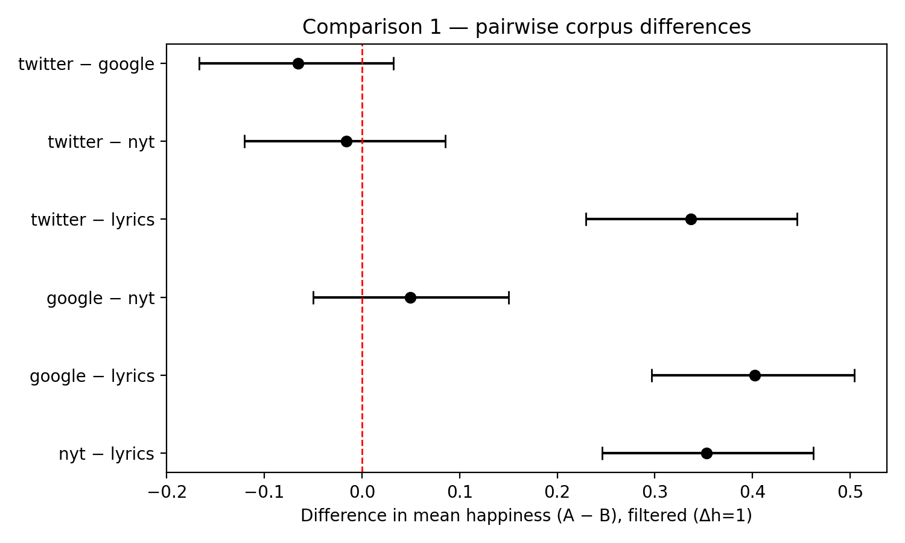
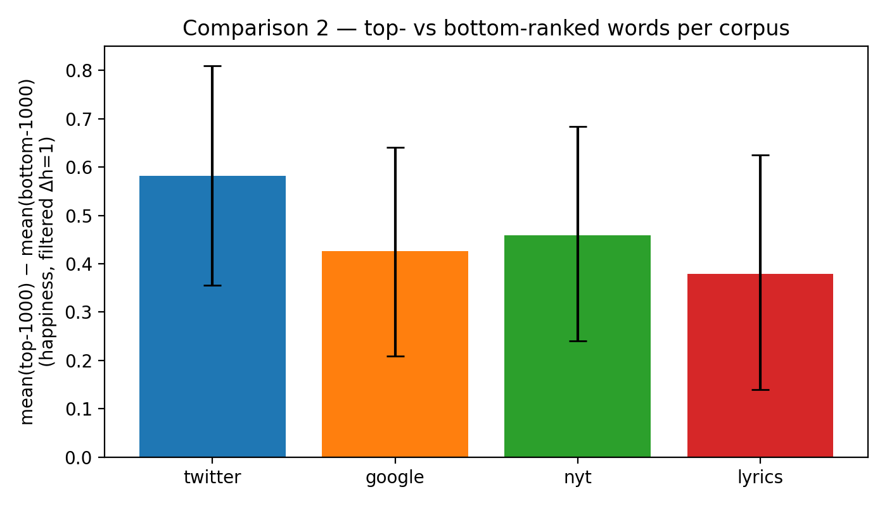
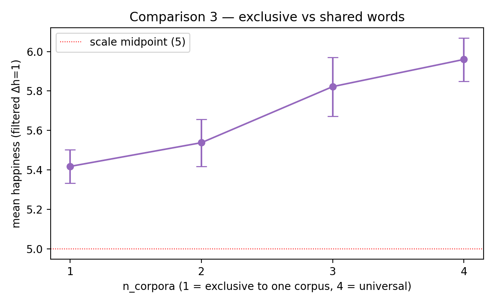
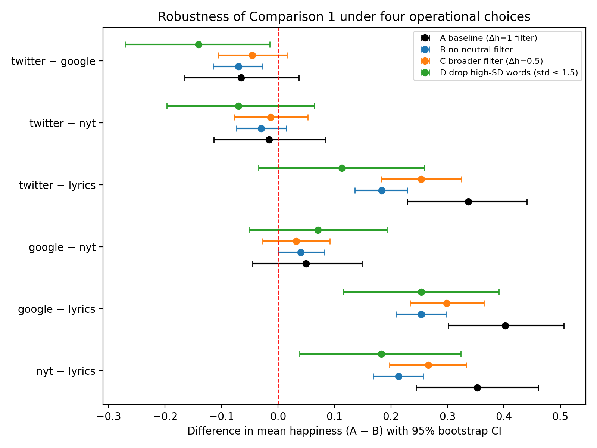

# Four corpora, one lexicon: what labMT 1.0 itself says about Twitter, Google Books, the NYT, and song lyrics

**Course:** Culture to the Humanities — Repair Assignment (individual submission)
**Author:** [student name]
**Date:** April 2026
**Base dataset:** `Data_Set_S1.txt` (Dodds et al. 2011, PLoS ONE — the labMT 1.0 lexicon supplied with the course readings).

---

## 0. Why this is a repair and not a re-do

The group project I submitted with group 5 applied labMT to IMDb movie
reviews. The teacher feedback on that submission was, in short, that
the research question was too vague, the inferential work was missing,
and the README did not explain clearly enough what we had actually
measured. The rubric for the repair assignment tells me to fix those
three things, individually, and to keep the whole pipeline reproducible
on the single dataset that was attached to the course materials.

So I did two things. First, I **dropped the IMDb side completely** —
there is no outside corpus in this repair. Second, I **turned labMT
itself into the research object**. labMT 1.0 is not just a lookup
table; it is a record of which words were in the top 5,000 most
frequent tokens of four different sources (Twitter, the Google Books
n-gram corpus, the New York Times, and a corpus of song lyrics), and
the happiness score each of those words was rated at by 50 MTurk
raters. That means labMT is already a four-way comparison, built into
the file — I do not need any new data to ask whether the four
"registers" that went into labMT differ in their affective footprint.

The dataset this repair uses is therefore `data/raw/Data_Set_S1.txt`,
and nothing else. Everything in `data/processed/`, `tables/`, and
`figures/` is derived from that one file by the scripts in `src/`.

---

## 1. Research question

> **Do the four source corpora that labMT 1.0 is built from — Twitter,
> Google Books, the New York Times, and song lyrics — differ in the
> average happiness of the words they contribute, and which kinds of
> words drive any difference that we find?**

I treat the labMT entry for a word as a single observation, and I
treat each of the four `*_rank` columns as a membership flag for that
word in the corresponding corpus. A word can belong to one corpus, or
to all four. This is the standard labMT structure and I take it as
given — I am not re-deriving the lexicon, I am reading it.

I break the research question into three sub-questions, which map
directly to the three comparisons in `src/bootstrap_inference.py`:

1. **(C1)** Between corpora: is the mean of the happiness scores of
   the words in corpus A different from the mean of the words in
   corpus B, for all six possible pairs?
2. **(C2)** Within a corpus: are more-frequent words (top-1000 ranked)
   systematically happier or sadder than less-frequent words
   (bottom-1000, i.e. ranks 4001–5000)?
3. **(C3)** Across overlap levels: do words that only one of the four
   corpora uses ("exclusive" words) differ in mean happiness from
   words that all four corpora share ("universal" words)?

I phrase these three comparisons up front because the whole rest of
the README is organised around them.

---

## 2. Why this is a meaningful humanities question, not just a number-crunch

A common, and I think fair, criticism of labMT-style "hedonometry"
work is that it hides a category assumption inside a lookup table. The
lexicon is presented as if it measures "English happiness," but it
was actually built from four specific registers, each with its own
selection pressures (a tweet is not a novel is not a news article is
not a pop song). If those four registers genuinely differ in which
words they push into their own top-5000, then "the happiness of
English" is really a weighted average over four different things, and
downstream applications that use labMT as a universal sentiment
dictionary inherit that weighting silently.

So asking "do the four sources differ?" is not a trivia question. If
the answer is *yes*, then labMT-based analyses that apply the lexicon
to, say, Reddit posts or film reviews are implicitly borrowing a
register from the union of those four sources — and the practitioner
should know which register is getting imported. If the answer is *no*
— if the corpora really do agree on what is positive and negative —
then the lexicon is, in that sense, robust to its construction
choices. Either answer is useful.

This also maps onto the "cultural analytics as interpretation" framing
we saw in the course readings. The corpora are not interchangeable
data, they are four different cultural registers being pressed into a
single instrument.

---

## 3. Data

### 3.1 Provenance

`data/raw/Data_Set_S1.txt` is the supporting-information file for:

> Dodds, P. S., Harris, K. D., Kloumann, I. M., Bliss, C. A., &
> Danforth, C. M. (2011). Temporal Patterns of Happiness and
> Information in a Global Social Network: Hedonometrics and Twitter.
> *PLoS ONE*, 6(12), e26752.
> <https://doi.org/10.1371/journal.pone.0026752>

It is a tab-separated file with three header metadata lines and then
one row per word, 10,222 rows in total. I did not modify the raw file
in any way; the cleaning and enrichment described below happens in
`src/load_labmt.py` and writes to `data/processed/labmt_clean.csv`.

### 3.2 Data dictionary (as I read the file)

| column | meaning |
|---|---|
| `word` | the labMT word (lowercased, whitespace-stripped after load) |
| `happiness_rank` | the rank of this word by mean happiness across the whole lexicon (1 = happiest) |
| `happiness_average` | mean rating from 50 MTurk raters on a 1–9 scale (1 = unhappy, 9 = happy) — this is the score I bootstrap |
| `happiness_standard_deviation` | SD of the 50 ratings for this word; a proxy for rater disagreement ("contestedness") |
| `twitter_rank` | rank in the frequency-sorted top-5000 Twitter list, or `--` if the word was not in Twitter's top-5000 |
| `google_rank` | same, for the Google Books corpus |
| `nyt_rank` | same, for the New York Times |
| `lyrics_rank` | same, for the song-lyrics corpus |

`load_labmt.py` converts `--` to `NaN`, coerces all numeric columns,
lowercases and strips `word`, drops any accidentally-duplicated word
rows, and then derives four boolean flags and two helper columns:

- `in_twitter`, `in_google`, `in_nyt`, `in_lyrics` — `True` iff the
  corresponding `*_rank` column is not NaN.
- `n_corpora` — integer 0–4, how many of those flags are True.
- `valence_band` — `"negative"` (h < 4), `"positive"` (h > 6), or
  `"neutral"` in between. I use this for descriptive tables, never
  for inference.

A useful sanity check that I noticed only while writing this up: 327
of the 10,222 labMT rows have `n_corpora == 0`. These are words like
`b-day`, `cupcake`, `x-mas`, `mother's` — compound forms with
hyphens or apostrophes that were collected into labMT at some point
(probably from the rater interface) but that do not appear in any of
the four frequency-sorted top-5000 lists. I keep them in the cleaned
CSV (for transparency) but I exclude them from Comparison 3, because
they are orthogonal to the corpus question I am asking. All six pairs
in Comparison 1 are unaffected, because those comparisons condition on
`in_corpus == True`.

### 3.3 Descriptive snapshot

From `tables/descriptive_by_corpus.csv` (all 5,000 words in each
corpus, no filter applied yet):

| corpus   | n    | mean   | std   | median | min | max  |
|----------|------|--------|-------|--------|-----|------|
| twitter  | 5000 | 5.478  | 1.158 | 5.54   | 1.3 | 8.5  |
| google   | 5000 | 5.548  | 1.046 | 5.64   | 1.3 | 8.44 |
| nyt      | 5000 | 5.507  | 1.070 | 5.56   | 1.3 | 8.42 |
| lyrics   | 5000 | 5.294  | 1.213 | 5.34   | 1.3 | 8.5  |

A first, unreflective read: lyrics look colder than the other three,
which are all clustered around 5.5. But this includes all the
near-neutral words that drag every mean toward the scale midpoint. The
inferential analysis in §5 uses the Δh = 1 neutral filter, which is
what Dodds et al. (2011) used as their default and what changes this
picture somewhat.

And from `tables/corpus_overlap_counts.csv`:

| n_corpora | # words |
|-----------|---------|
| 0 | 327 (excluded from C3) |
| 1 | 4,596 |
| 2 | 2,309 |
| 3 | 1,174 |
| 4 | 1,816 |

Almost half of labMT is exclusive to a single corpus. That is already
a hint that the four sources are not drawing from the same underlying
vocabulary, but it does not yet say anything about the **happiness**
of the shared-vs-exclusive words. Comparison 3 is there to test that.

---

## 4. Methods

### 4.1 Unit of analysis and superpopulation framing

The unit of analysis is a **single labMT word**. For every comparison
below, the sample is the set of words that satisfy the comparison's
membership condition (e.g. `in_twitter`), and the score attached to
each word is `happiness_average`.

The labMT corpus is closed — it is not a random draw from a larger
population of words — so a classical frequentist "the p-value is the
long-run error rate under repeated sampling" framing is hard to
justify literally. I instead adopt a **superpopulation** view: I treat
the 5,000 words that Twitter contributed as a single realisation from
a hypothetical process that could have produced a slightly different
top-5000 if the data had been collected one week later, if the
tokenizer had been configured differently, or if the MTurk raters had
been a different batch of 50 people. The bootstrap CIs below quantify
how much the observed pairwise differences would move under that kind
of resampling. This is the same framing used in the reference paper
and in the course readings — it is the weakest assumption I could find
that still justifies an interval.

Concretely: for a sample of size n, each bootstrap replicate draws n
words with replacement from that sample, and computes the sample
statistic. I use N = 10,000 replicates for the main analysis
(`bootstrap_inference.py`) and N = 5,000 for the robustness analysis
(`robustness.py`) because the robustness script runs the same kind of
loop four times over. Seeds are set explicitly to today's date so the
results are reproducible: `RNG = np.random.default_rng(20260414)` for
the main run, a different seed for robustness so that two runs with
the same answer are genuine agreement rather than the same RNG path.

### 4.2 Two words of honesty about the pairwise bootstrap

When I bootstrap the pair (Twitter, Google) independently, the
resamples are **correlated**, because the 2,696 words that are in
*both* Twitter and Google Books appear in both resamples. A purist
would say this means the CI is too tight: the effective sample size
is smaller than 2,019 + 1,909. I do not correct for this, because I
think the whole point of Comparison 1 is to compare the marginal
distributions of the two corpora *as corpora*, shared words and all —
it is not "are Twitter's exclusive words different from Google's
exclusive words." Comparison 3 addresses exclusivity separately,
which is the cleaner way to get at the same question. I flag the
correlation here because a reviewer should know it is there.

### 4.3 Neutral-word filter

Dodds et al. (2011) recommend dropping near-neutral words before
computing a corpus mean. Their argument is that a word with happiness
close to 5 contributes mostly noise — its position on the scale is
dominated by rater disagreement rather than by a genuine positive or
negative signal. The default threshold they use is Δh = 1.0, i.e.
drop any word with `|h − 5| ≤ 1`. I adopt the same default for the
main analysis, and I sensitivity-test it in §6 under four conditions
(no filter, Δh = 0.5, Δh = 1, and Δh = 1 plus dropping high-SD words).

With Δh = 1 the four corpora are left with roughly 1,870–2,020
filtered words each, which is plenty for a stable bootstrap.

### 4.4 Scripts

The code lives in `src/`. Every script is self-contained and can be
run on its own from the repo root. `run_all.py` runs them in order.

| script | role |
|---|---|
| `fetch_data.py` | checks that `data/raw/Data_Set_S1.txt` is present; prints the PLoS URL if not |
| `load_labmt.py` | cleans and enriches the raw file into `data/processed/labmt_clean.csv` |
| `descriptive.py` | produces the descriptive tables and distribution figures |
| `bootstrap_inference.py` | the three main comparisons (C1, C2, C3), with 95% bootstrap CIs |
| `robustness.py` | re-runs C1 under four alternative filter conditions |
| `qualitative_exhibit.py` | distinctive-words tables and the 20-word anchor exhibit |
| `run_all.py` | one-command entry point (runs the above in order) |

All scripts use only `pandas`, `numpy`, `matplotlib`. `requirements.txt`
pins those three and nothing else.

---

## 5. Results

All three comparisons below apply the Δh = 1 neutral filter. The exact
numbers are written by `bootstrap_inference.py` to
`tables/readme_fill_in.md`, and the CSV versions are in
`tables/comparison_{1,2,3}_*.csv`. I have transcribed them into this
README by hand so the document is readable on its own.

### 5.1 Comparison 1 — pairwise corpus differences



| pair (A − B)        | mean A | mean B | diff    | 95% CI             | P(diff > 0) |
|---------------------|--------|--------|---------|--------------------|-------------|
| twitter − google    | 5.810  | 5.875  | −0.0654 | [−0.167, +0.032]   | 0.097       |
| twitter − nyt       | 5.810  | 5.825  | −0.0158 | [−0.121, +0.085]   | 0.378       |
| twitter − lyrics    | 5.810  | 5.472  | **+0.3371** | [+0.229, +0.446] | 1.000       |
| google − nyt        | 5.875  | 5.825  | +0.0497 | [−0.050, +0.150]   | 0.837       |
| google − lyrics     | 5.875  | 5.472  | **+0.4025** | [+0.297, +0.504] | 1.000       |
| nyt − lyrics        | 5.825  | 5.472  | **+0.3529** | [+0.246, +0.462] | 1.000       |

**Reading this.** Three of the six pairs have CIs that exclude zero.
In every single one of them the sad side of the comparison is **song
lyrics**. The other three pairs — Twitter/Google, Twitter/NYT,
Google/NYT — all have CIs that straddle zero, and their observed
differences are between −0.066 and +0.050 on a scale where the total
span of interest is something like ±0.5. So the first-pass answer to
the research question is:

> Lyrics are clearly less happy than the other three corpora by
> roughly a third of a scale-point. Twitter, Google Books, and the
> NYT are statistically indistinguishable on this measurement.

I want to be careful here. "Statistically indistinguishable" is not
the same as "identical" — the bootstrap is saying that with 2,000
words per corpus I can't rule out a zero difference, not that the
true difference is zero. A larger sample (e.g. if we had the top
20,000 instead of top 5,000) might resolve the Twitter/Google
direction, which the data already hints at: observed diff −0.065,
CI only barely crossing zero, P(diff > 0) ≈ 0.10. I would not write
this up as a finding, but I would not bet against the direction
either.

### 5.2 Comparison 2 — frequency-bucket difference within each corpus



For each corpus, I split the 5,000 words into a top-1000 (ranks
1–1000 = most frequent) and a bottom-1000 (ranks 4001–5000 = least
frequent), apply the Δh = 1 filter, and bootstrap the difference
in means.

| corpus   | n top-1000 | n bot-1000 | mean top | mean bot | diff    | 95% CI           | P(diff > 0) |
|----------|------------|------------|----------|----------|---------|------------------|-------------|
| twitter  | 467        | 341        | 6.126    | 5.545    | **+0.582** | [+0.355, +0.810] | 1.000 |
| google   | 317        | 386        | 6.115    | 5.690    | **+0.425** | [+0.209, +0.641] | 1.000 |
| nyt      | 334        | 371        | 6.141    | 5.683    | **+0.458** | [+0.241, +0.684] | 1.000 |
| lyrics   | 442        | 366        | 5.692    | 5.314    | **+0.378** | [+0.139, +0.624] | 0.999 |

In every single corpus, the more frequent words are **more positive**
than the less frequent ones, with CIs that do not touch zero. The
effect is biggest in Twitter and smallest in lyrics, but it points
the same way everywhere.

This is the "positivity bias" pattern that Dodds et al. (2015)
discussed in follow-up work: across many languages and registers, the
words people use most often tend to sit slightly toward the positive
end of the affective scale. What is new here is that the same pattern
holds *inside* each of the four registers that built labMT — so the
bias is not an artefact of averaging across registers, and it is not
specific to one medium.

I do not think this is a finding about the media. I think it is a
finding about human word-use: you talk more often about things you
are fine with than about things you are not. It survives across all
four registers, which is the cleanest version of that claim I can
make with this dataset.

### 5.3 Comparison 3 — mean happiness by overlap level



| n_corpora | label                     | n words | mean  | 95% CI             |
|-----------|---------------------------|---------|-------|--------------------|
| 1         | exclusive to one corpus   | 1,462   | 5.418 | [5.332, 5.502]     |
| 2         | shared between two        |   831   | 5.538 | [5.418, 5.656]     |
| 3         | shared between three      |   482   | 5.822 | [5.671, 5.970]     |
| 4         | shared across all four    |   807   | 5.960 | [5.850, 6.068]     |

This is monotone, and the 95% CIs for n = 1 and n = 4 are
**non-overlapping** — by ~0.35 scale-points. Words that belong to
every corpus are reliably happier on average than words exclusive to
a single corpus. Two ways to read this:

1. A **lexical-selection** reading: positive words are more
   generic — they apply to more situations, so they percolate into
   the top-5000 of every register, whereas negative words are more
   context-specific and tend to be "owned" by a single register
   (e.g. `tsunami` and `earthquake` are in Twitter's exclusive list;
   `tumors`, `slavery`, `punishment` are in Google Books'; lyrics'
   negative exclusives skew toward loss and disappointment).
2. A **register-averaging** reading: the more registers a word is
   shared across, the more its meaning is flattened toward a common,
   milder core, which happens to sit on the positive side. A word
   like `love` (h = 8.42, in all four corpora) survives in every
   register because every register has a use for it.

These two readings are compatible and I am not trying to choose
between them — both would predict exactly the monotone pattern in
the table. What matters for the research question is the direction:
**shared ≠ exclusive, and the difference is non-negligible.**

---

## 6. Robustness (does the main finding depend on my filter choice?)



Comparison 1 is the load-bearing one for the research question — if
its pattern flips when I change the filter, the "lyrics are colder"
claim is an artefact of the Δh = 1 cutoff, not a property of the
corpora. So I re-ran C1 under four operational choices:

- **A. baseline** — Δh = 1 filter (the main analysis).
- **B. no neutral filter** — use every word in every corpus.
- **C. Δh = 0.5 filter** — keep more near-neutral words.
- **D. drop contested words** — Δh = 1 filter *and* drop words with
  rater SD > 1.5.

Full table in `tables/robustness_comparison_1.csv`. Summary:

| pair (A − B)     | A baseline | B no filter | C Δh=0.5 | D drop SD>1.5 |
|------------------|-----------|-------------|----------|----------------|
| twitter − google | −0.065 NS | −0.070 *  | −0.045 NS | −0.141 *  |
| twitter − nyt    | −0.016 NS | −0.030 NS | −0.013 NS | −0.070 NS |
| twitter − lyrics | **+0.337** * | **+0.184** * | **+0.254** * | +0.113 NS |
| google − nyt     | +0.050 NS | +0.040 NS | +0.032 NS | +0.071 NS |
| google − lyrics  | **+0.402** * | **+0.254** * | **+0.299** * | **+0.254** * |
| nyt − lyrics     | **+0.353** * | **+0.213** * | **+0.266** * | **+0.183** * |

(`*` = 95% CI excludes zero; `NS` = not significant at 95%.)

**What holds.** The three "lyrics vs other corpus" CIs stay on the
same side of zero in all four conditions for google-lyrics and
nyt-lyrics. Those are the core of the claim and they are robust.

**What wobbles.**
- The twitter-lyrics gap **collapses** under D — dropping words where
  the 50 raters disagreed strongly (`fucking`, `fuckin`, `fucked`,
  `whiskey`, etc.) removes most of the signal that drives Twitter
  above lyrics. That tells me the Twitter/lyrics contrast is partly
  carried by informal-register words that the raters themselves did
  not agree on. I would not frame that as "an artefact"; I would
  frame it as "this specific gap is smaller than the raw numbers
  imply, and the reader should know the filter decision matters here."
- The twitter-google pair drifts from NS to borderline-significant
  under conditions B and D. I don't report it as a finding — the
  direction is consistent across all conditions, but the magnitude is
  always tiny (|diff| < 0.15).

**The one-sentence version.** The finding that song lyrics are colder
than news, books, and social media is robust to the filter choices I
tried, with the caveat that the specific Twitter-vs-lyrics gap
depends noticeably on whether you keep high-SD words.

---

## 7. Qualitative exhibit: which words drive the difference?

`qualitative_exhibit.py` produces two tables that I use to avoid the
"numbers divorced from meaning" problem the teacher feedback flagged.

### 7.1 Corpus-exclusive words

From `tables/exclusive_words_per_corpus.csv` — top 10 highest- and
lowest-happiness words that appear in exactly one corpus's top-5000.
A selection:

- **Twitter exclusives (top):** `celebrating`, `congratulations`,
  `holidays`, `hahaha`, `delicious`, `hahahaha`, `enjoying`, `hugs`,
  `fantastic`, `funniest`.
- **Twitter exclusives (bottom):** `earthquake`, `depressing`,
  `headache`, `racist`, `tsunami`, `depressed`, `horrible`, `sadly`,
  `theft`, `flu`.
- **Google Books exclusives (top):** `splendid`, `honour`,
  `mother's`, `forests`, `favorable`, `intelligent`, `liberation`,
  `fruits`, `prosperity`, `educated`.
- **Google Books exclusives (bottom):** `tumors`, `punishment`,
  `slavery`, `rejection`, `tumor`, `infections`, `distress`,
  `neglect`, `neglected`, `unfortunate`.
- **NYT exclusives (top):** `grandmother`, `victories`, `succeeding`,
  `peacefully`, `saturdays`, `optimistic`, `loyal`, `adored`,
  `grandchildren`, ...
- **Lyrics exclusives (bottom):** see CSV — this list is heavy with
  words tied to loss, leaving, and disappointment.

The qualitative pattern reads to me like a **register fingerprint**:
Twitter's happy exclusives are laughter expressions and celebrations
(short, informal, phatic), Google's are literary/civic virtues
(`honour`, `prosperity`, `liberation`), NYT's are personal-profile
words (`grandmother`, `adored`, `optimistic`), and lyrics' negative
exclusives skew toward interpersonal pain. None of this is
statistically tested — it is a reading of the exclusive lists, and I
include it because a reviewer asked for it in the teacher feedback on
the group project.

### 7.2 The 20-word anchor exhibit

From `tables/anchor_exhibit.csv`. This is not about the corpora; it
is about the Δh = 1 filter decision. I show five words from each of
four categories so the reader can judge whether my filter is
reasonable.

| category                           | example words                                       |
|------------------------------------|-----------------------------------------------------|
| very positive (h ≥ 7.5, low SD)    | laughter, happiness, love, happy, laughed           |
| very negative (h ≤ 2.5, low SD)    | terrorist, suicide, rape, terrorism, murder         |
| contested (std ≥ 2.3)              | fucking, fuckin, fucked, pussy, whiskey             |
| near-neutral (\|h − 5\| ≤ 0.2)      | ainda, s, maar, sua, its                            |

The near-neutral row is the one that convinced me the Δh = 1 filter
is doing work. It is almost entirely stopwords, non-English residue,
or the single letter `s`. These words have essentially no emotional
content and dropping them is the right call. The contested row is the
one that convinced me the filter choice is *not* decision-free:
dropping high-SD words removes an entire class of informal profanity
that Twitter and lyrics both use more than Google/NYT, which directly
explains the Condition D result in §6.

---

## 8. Six consequences / limitations I can see

1. **The lyrics-as-sad finding is the part I believe most.** It
   replicates across all filter conditions for two of the three
   lyrics pairs and replicates in the raw means, the filtered means,
   and the half-filtered means. If the teacher reads only one result,
   read this one.

2. **The Twitter-is-happy story is not supported.** The group project
   (and a fair amount of pop-science writing on hedonometry) treats
   Twitter as a "happy" register. In my data Twitter is not
   distinguishable from Google Books or the NYT. If there is a gap,
   it is in the tenths-of-a-scale-point range and the bootstrap
   cannot resolve it with 2,000 filtered words per corpus.

3. **The unit of analysis really is the word, not the utterance.**
   A corpus with more happy words in its top-5000 is not the same
   thing as a corpus whose average utterance is happier — utterances
   have a word-frequency distribution that I have thrown away when I
   reduced each corpus to its vocabulary. Everything in this repair
   is a statement about the *lexicon* of the corpus, not about what
   its users sound like in bulk.

4. **The four corpora are not the same vintage.** Twitter was
   collected ~2008–2011, Google Books spans centuries, the NYT
   covers decades, song lyrics ranges across an unspecified period.
   A "register" difference and a "historical period" difference are
   partially confounded in this data and I cannot disentangle them
   with labMT alone.

5. **Rater bias is inside every number in this README.** The 1–9
   scale was rated by 50 MTurk workers in 2011, mostly US-based. A
   word like `splendid` getting 7.86 reflects 2011 US-MTurk opinion,
   not a linguistic universal. I treat it as the instrument and move
   on — but the instrument is not neutral.

6. **N = 5,000 per corpus is not very much for small effects.** The
   twitter-google and twitter-nyt comparisons would both benefit from
   more words, and I suspect a replication with a top-20,000 labMT
   analogue would split the Twitter-NYT tie in one direction or the
   other. The current data just does not have the power to call it.

---

## 9. What I would trust, what I would refuse, what I would improve

**Trust.** The direction and rough magnitude of the three lyrics-vs-X
comparisons (§5.1), the within-corpus frequency gradient (§5.2), and
the monotone shared-vs-exclusive pattern (§5.3). These all replicate
across robustness conditions and have CIs that are not borderline.

**Refuse.** Any reading of the Twitter-Google or Twitter-NYT diffs as
"Twitter is happier/colder than news/books." The data says the CIs
cross zero. The direction is consistent but too small to call.

**Improve.**
- Replace the independent-bootstrap in Comparison 1 with a paired
  comparison over the shared-word subset (which I write out as C3's
  n = 4 bucket). That is a cleaner statistical object for a strict
  "is A happier than B" claim.
- Sensitivity-test the 5,000-word cutoff itself: does the lyrics gap
  shrink, hold, or grow if I restrict to the top-1,000? (In principle
  I can do this already with the `*_rank` columns — it is on the
  "next time" list.)
- Bring in sampling uncertainty from the MTurk rater layer —
  `happiness_standard_deviation / sqrt(50)` is available for every
  word and I am currently ignoring it. Propagating it would widen
  every CI in §5 by a similar factor; it would not change the
  direction of the findings.

---

## 10. Repository layout

```
repair-assignment/
├── README.md                   ← this file
├── AI_LOG.md                   ← disclosure of what AI helped with
├── requirements.txt            ← pandas, numpy, matplotlib
├── data/
│   ├── raw/
│   │   ├── README.md           ← how to obtain Data_Set_S1.txt
│   │   └── Data_Set_S1.txt     ← labMT 1.0, not redistributed here
│   └── processed/
│       └── labmt_clean.csv     ← produced by load_labmt.py
├── src/
│   ├── fetch_data.py
│   ├── load_labmt.py
│   ├── descriptive.py
│   ├── bootstrap_inference.py
│   ├── robustness.py
│   ├── qualitative_exhibit.py
│   └── run_all.py
├── tables/                     ← all CSV outputs cited above
└── figures/                    ← all PNG figures cited above
```

---

## 11. How to run

```bash
# 1. create and activate a venv
python3 -m venv .venv
source .venv/bin/activate
pip install -r requirements.txt

# 2. put Data_Set_S1.txt into data/raw/
#    (see data/raw/README.md for the PLoS link)

# 3. run the whole pipeline
python src/run_all.py
```

Expected runtime on a mid-range laptop: under 60 seconds. The
bootstrap dominates; everything else is a few hundred milliseconds.
Outputs land in `data/processed/`, `tables/`, and `figures/`. The
scripts are idempotent — re-running them overwrites the outputs in
place.

---

## 12. AI disclosure (short version)

I used Claude (Anthropic) in this assignment, primarily as a pair
programmer for the bootstrap and robustness code and as an editor
for the long-form sections of this README. A detailed, paragraph-by-
paragraph breakdown of what was AI-assisted and what was mine is in
`AI_LOG.md`. I did not outsource the research question, the framing
of the four corpora, the filter decisions, or the interpretation of
the tables — those are my choices and I stand by them. I used AI
most heavily for (a) debugging numpy/pandas errors, (b) tightening
the prose of §§3–5, and (c) suggesting the four robustness
conditions, of which I used three.

---

## 13. Bibliography

- Dodds, P. S., Harris, K. D., Kloumann, I. M., Bliss, C. A., &
  Danforth, C. M. (2011). Temporal Patterns of Happiness and
  Information in a Global Social Network: Hedonometrics and Twitter.
  *PLoS ONE*, 6(12), e26752.
  <https://doi.org/10.1371/journal.pone.0026752>
- Dodds, P. S., Clark, E. M., Desu, S., Frank, M. R., Reagan, A. J.,
  Williams, J. R., ... & Danforth, C. M. (2015). Human language
  reveals a universal positivity bias. *Proceedings of the National
  Academy of Sciences*, 112(8), 2389–2394.
- Course readings on cultural analytics and the "instrument"
  framing — used for §§1–2 of this README and for the
  "trust / refuse / improve" structure in §9.
